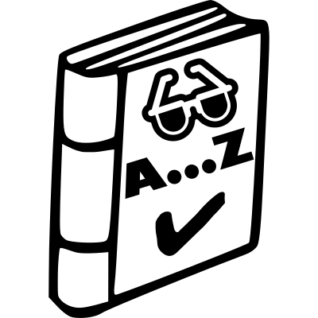
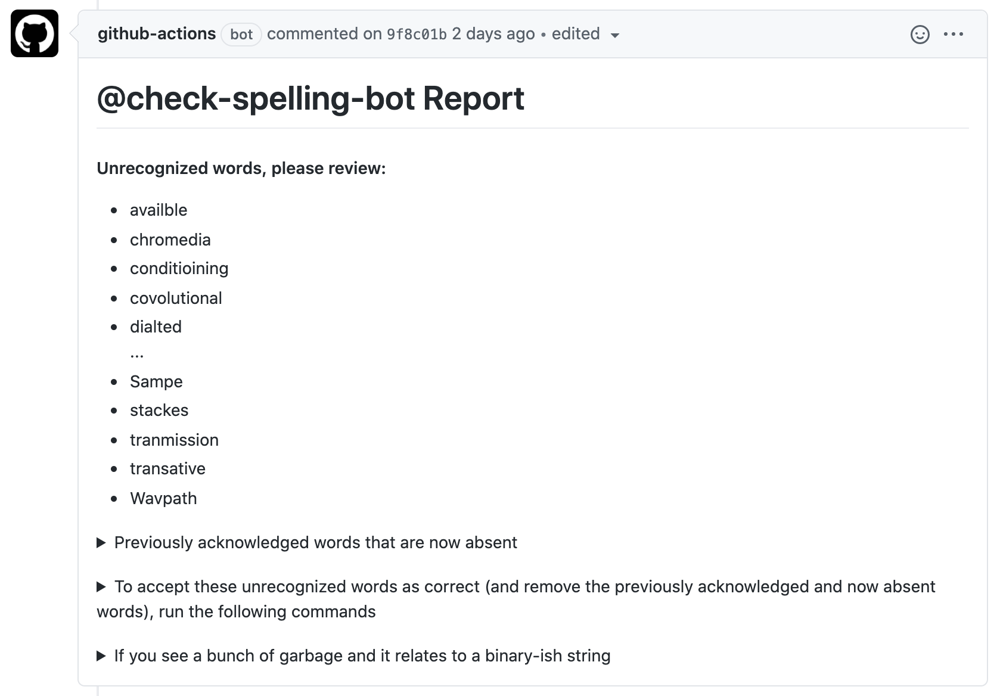
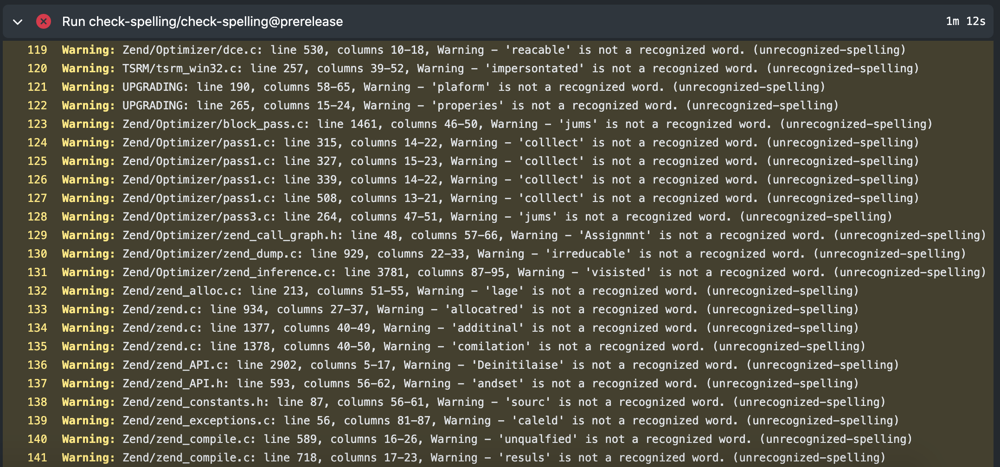

#  check-spelling action <!-- markdownlint-disable MD033 -->

Everyone makes typos. This includes people writing documentation and comments,
but it also includes programmers naming variables, functions, apis, classes,
and filenames.

## Programmer friendly

Often, programmers will use `InitialCapitalization`, `camelCase`,
`ALL_CAPS`, or `IDLCase` when naming their things. When they do this, it makes
it much harder for naive spelling tools to recognize misspellings, and as such,
with a really high false-positive rate, people don't tend to enable spell-checking
at all.

Unlike those traditional spell checkers, this one is able to handle all of those
kinds of tokens.

## What you get

### Experimental

_This feature should work well for small teams where everyone is a member of the org._
_It is not ready for repositories with lots of bots or where multiple non-members interact in PRs._

If you'd like to test this feature, but fall into these categories, you can try the `prerelease` branch.

## Information

* [🏃 Quick Start](https://github.com/check-spelling/spell-check-this/)
* [📄 Documentation](https://github.com/check-spelling/check-spelling/wiki)
* [🏬 Marketplace listing](https://github.com/marketplace/actions/check-spelling)
* [📅 Releases](https://github.com/check-spelling/check-spelling/releases)
* [🖼 Presentation](https://docs.google.com/presentation/d/13U8a9ibqp7B1UrE8HWk7PsnZLImIwgp06vopLdmcX-s/present)

## Future work

* [🗺️ Possible features](https://github.com/check-spelling/check-spelling/wiki/Possible-features)
* [🐛 Issues](https://github.com/check-spelling/check-spelling/issues)

## The code

* [✏️ Source code](https://github.com/check-spelling/check-spelling/)

## Connect

[ @_check_spelling](https://twitter.com/_check_spelling)
